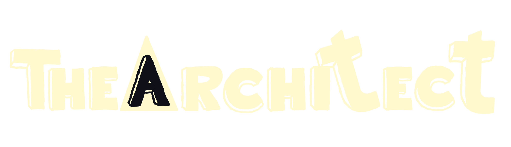
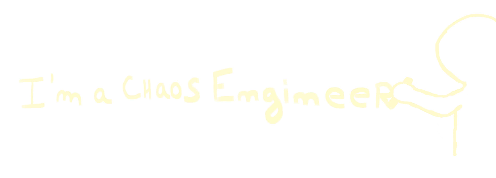
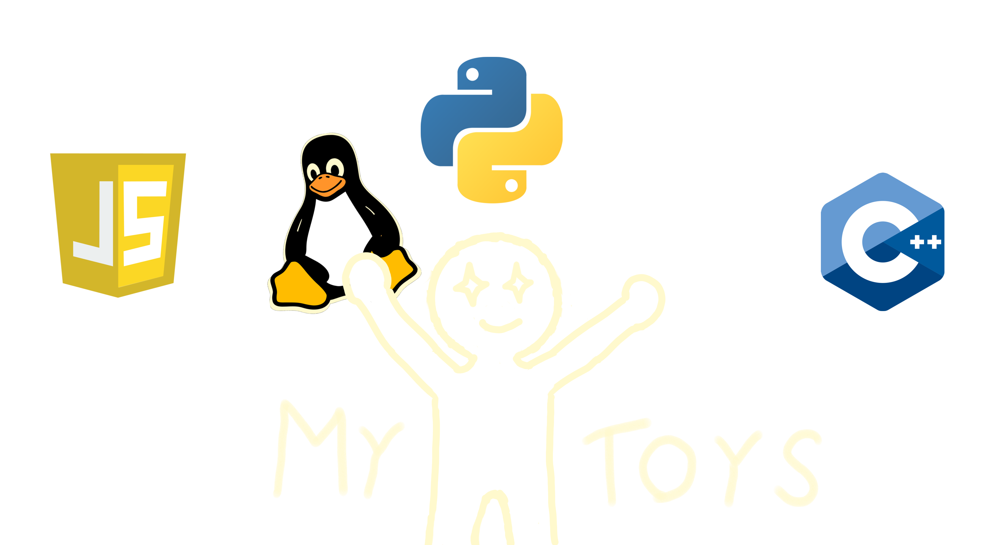
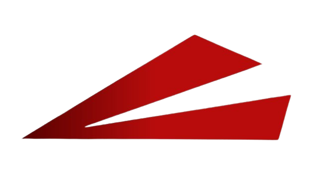
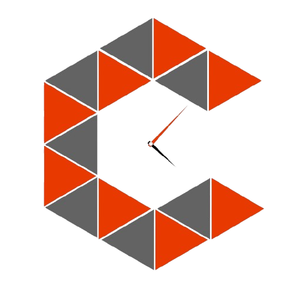
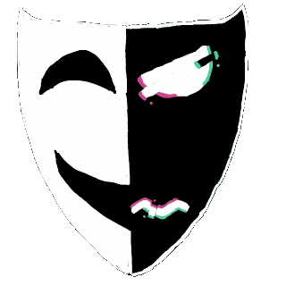

  

### Hey 👋

Building things, breaking systems, and learning from the chaos.

---

# About me

> **If I had to describe myself in one sentence...**

  

# Skills

  

# Projects

# Projects

  
  
  
  

# New Profile - Coming soon...
